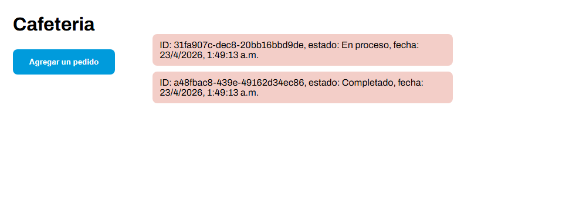

# Lección 01 - Event loop y asincronicidad: Simulador de Pedidos en una Cafetería 

En una cafetería moderna, es común que los clientes realicen pedidos que requieren preparación mientras se reciben nuevos pedidos. Una interfaz debe mostrar los pedidos en progreso, permitir que los baristas trabajen en ellos de manera asincrónica y actualizar el estado de los pedidos en tiempo real. El desafío consiste en simular este sistema mediante JavaScript, utilizando el Event Loop y diferentes mecanismos de asincronía como `setTimeout`, Promises y `async/await`.

Crear una simulación interactiva que permita simular algunas actividades en una cafetería:

1. Reciba nuevos pedidos de clientes.
2. Procese cada pedido de manera asincrónica con un tiempo de preparación simulado.
3. Actualice el estado de cada pedido ('En Proceso' -> 'Completado') en la interfaz de usuario.


## Archivos del repositorio

- **./practica-leccion/index.html**: Archivo HTML del proyecto, conectando el script.js 

- **./practica-leccion/style.css**: Archivo CSS del proyecto, conteniendo los estilos del proyecto

- **./practica-leccion/script/app.js**: Archivo de Javascript con la práctica realizada para este proyecto


## Aprendizajes:

- Asincronicidad
- Promises
- Async/await


## Evidencia visual

A continuación se muestra una captura de pantalla del código funcionando en la consola del navegador:





## Ejemplo de uso

Abra el archivo 
```./practica-leccion/index.html```
en su navegador y revise el sitio web para probar la funcionalidad del mismo

También puede mirar el código de JavaScript abriendo el archivo
```./practica-leccion/script/app.js```
dentro de su editor de código preferido o dentro de Github.

## Despliegue

Se desplegó en Github Pages a partir de este repositorio, puedes ver la página a través del siguiente link:
https://mor4n.github.io/05-desarrollo-avanzado-en-javascript/01-event-loop-y-asincronicidad/practica-leccion/index.html


## Como conclusión personal:
En esta práctica pude aprender sobre la asincronicidad, la cual siento que es uno de los conceptos más importantes que existen, usé algunos recursos como uno de stackoverflow para obtener un numero aleatorio en especifico y otro de Youtube para generar un UUID aleatorio, los cuales me fueron de bastante ayuda para el realizado del programa.

## Fuentes:

[Generar numeros random especificos](https://stackoverflow.com/questions/4959975/generate-random-number-between-two-numbers-in-javascript)

[Generar UUID aleatorio](https://www.youtube.com/watch?v=jRuLyWeaUxk)
