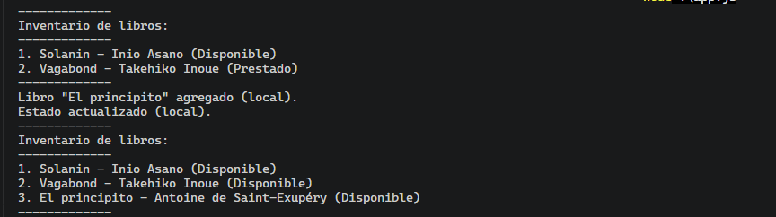
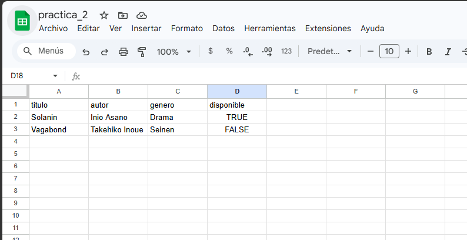
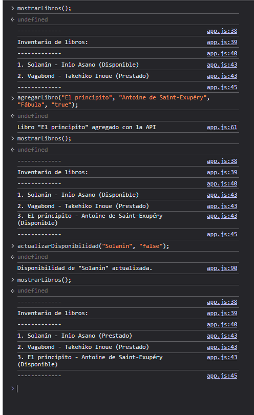
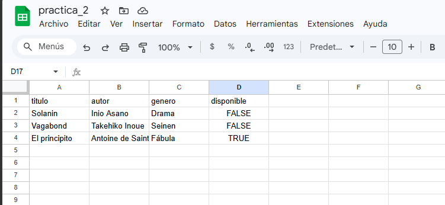

# Lección 02 - Callbacks y JSON: Gestión de una Biblioteca de Libros


## Archivos del repositorio

- **./practica-leccion/index.html**: Archivo HTML del proyecto, conectando el script.js 

- **./practica-leccion/script/app.js**: Archivo de Javascript con la práctica realizada para este proyecto, tanto en consola como con interfaz con el HTML.


- **./capturas/Captura1.png**: Captura del programa en consola, ejecutando todo en local en caso de que esté vacía la api
- **./capturas/Captura2.png**: Captura inicial de la hoja de cálculo de Google
- **./capturas/Captura3.png**: Captura ejecución de comandos en el navegador, manipulandolo con la API de sheetdb
- **./capturas/Captura4.png**: Captura final de la hoja de cálculo de Google


## Aprendizajes:

- Uso de callbacks más a detalle
- Aplicación con API de Sheetdb.io


## Evidencia visual

A continuación se muestra una captura de pantalla del código funcionando en la consola del navegador:







## Ejemplo de uso

Abra el archivo 
```./practica-leccion/app.js```
en su terminal y ejecute el comando
``` node ./app.js ```

También puede mirar el código de JavaScript abriendo el archivo
```./practica-leccion/script/app.js```
dentro de su editor de código preferido o dentro de Github.

## Despliegue

Se desplegó en Github Pages a partir de este repositorio, puedes ver la página a través del siguiente link:
https://mor4n.github.io/05-desarrollo-avanzado-en-javascript/02-callbacks-y-JSON/practica-leccion/index.html


## Como conclusión personal:
En esta práctica pude aprender sobre los callbacks, los cuales, en cierto punto se me hizo un poco dificil de asimilar, ya que nunca había visto algo así, pero al mismo tiempo, fue super interesante tener de nuevo el ejemplo de la biblioteca, pero ahora aplicandole el fetch que llegamos a ver, en conjunto con la api de sheetdb.io, solo que por si acaso, no lo subí en el repositorio Q_Q (me dio miedo), pero anexé capturas de como funciona teniendolo conectado al URL!


