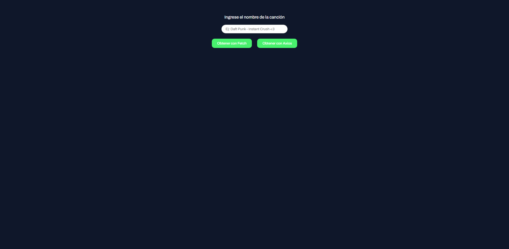
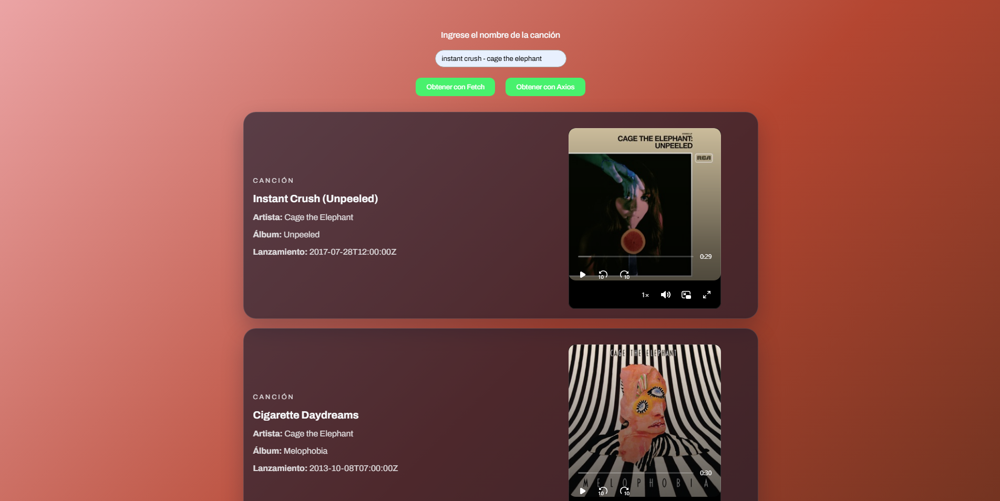
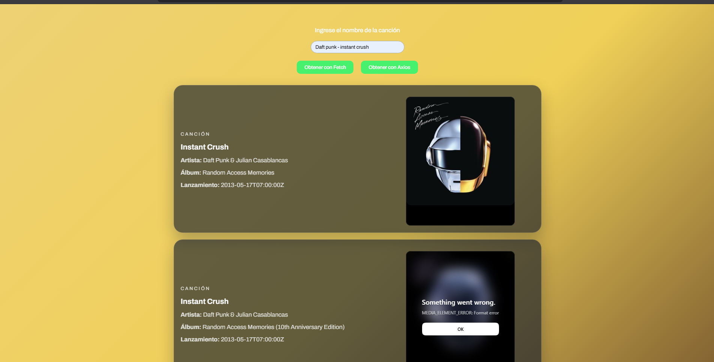

# Lección 03 - Fetch y Axios: Consumo de APIs con Fetch y Axios
"
El método fetch es una herramienta esencial para cualquier desarrollador JavaScript que desee trabajar con datos externos. Ofrece una forma moderna, limpia y eficiente de realizar solicitudes HTTP. Aunque es importante manejar los errores correctamente y comprender sus limitaciones, fetch es una opción poderosa y flexible para cualquier proyecto web. Axios es una herramienta poderosa y flexible para manejar solicitudes HTTP en JavaScript. Su facilidad de uso y características avanzadas lo hacen ideal para una variedad de aplicaciones, desde consumo de APIs hasta sistemas complejos.

El objetivo es que desarrolles las habilidades necesarias para realizar solicitudes HTTP y manejar datos obtenidos de APIs, utilizando tanto `fetch` como Axios. Además, practicarás el manejo de errores y la representación de datos en una interfaz gráfica sencilla.

En este proyecto, crearás una aplicación web sencilla que permita obtener información de personajes de una API de tu elección (como la de Star Wars o Rick & Morty). La aplicación deberá mostrar los datos obtenidos en la interfaz de usuario y ofrecerá dos botones para realizar las mismas solicitudes, uno utilizando `fetch` y otro utilizando `axios`. Esto te permitirá comparar el uso de ambas herramientas."


## Archivos del repositorio

- **./practica-leccion/index.html**: Archivo HTML del proyecto, conectando el script.js 

- **./practica-leccion/style.css**: Archivo CSS del proyecto, conteniendo los estilos del proyecto

- **./practica-leccion/script/app.js**: Archivo de Javascript con la práctica realizada para este proyecto


- **./capturas/Captura1.png**: Captura de pantalla de HTML inicial
- **./capturas/Captura2.png**: Captura de pantalla del HTML con fetch 
- **./capturas/Captura3.png**: Captura de pantalla del HTML con axios


## Aprendizajes:

- Obtención de datos de API's con:
    - Fetch
    - Axios
- Aplicación de CDN's como Axios, videojs y node-vibrant


## Evidencia visual

A continuación se muestra una captura de pantalla del código funcionando en la consola del navegador:






## Ejemplo de uso

Abra el archivo 
```./practica-leccion/index.html```
en su navegador y revise el sitio web para probar la funcionalidad del mismo

También puede mirar el código de JavaScript abriendo el archivo
```./practica-leccion/script/app.js```
dentro de su editor de código preferido o dentro de Github.

## Despliegue

Se desplegó en Github Pages a partir de este repositorio, puedes ver la página a través del siguiente link:
https://mor4n.github.io/05-desarrollo-avanzado-en-javascript/03-fetch-y-axios/practica-leccion/index.html


## Como conclusión personal:
En esta práctica pude aprender algo que realmente, no se porque pensé que era tan complicado, que era el obtener datos a través de una API.
En este caso, quise usar la API de Apple Music, ya que viendo la misma en su página, ví que existía la posibilidad de obtener un pedacito de la canción, con esto me imaginé de que "le voy a tratar de poner un mini reproductor a ver si funciona".
Entonces, busqué en internet cdn's de reproductores de video, ya que quería continuar usando cdns así como usamos el axios, en lugar de instalarlo con node.
Fue bastante genial el poder aprender sobre ambos, tanto fetch y axios, con fetch es un poquito más de texto y de conversión que con axios, pero siento que ambos se me hicieron muy buenos para usar en esta práctica :'D, hice varias funciones, tanto para obtener los datos ya sea con fetch o axios, para recorrer el arreglo de objetos de la respuesta y mostrarlos en el HTML, estoy intentando usar la destructuración cuando puedo y me gustó que pude aplicarlo aquí ;w; 
Ya cuando iba terminando, quise ponerle un degradado al fondo como en spotify y encontré varios cdn's que hacen esto, entre ellos Gradent.js y Vibrant.js, probé ambos (el primero no me funcionó) y el segundo fue el que vine usando finalmente
Al final de todo se le colocó un diseño tipo tarjetitas con los resultados que se obtuvieron n-n

## Fuentes:
[API de Apple music](https://performance-partners.apple.com/search-api)

[Reproductor de video/mp3](https://videojs.org/)

[Generar gradientes](https://vibrant.dev/)

