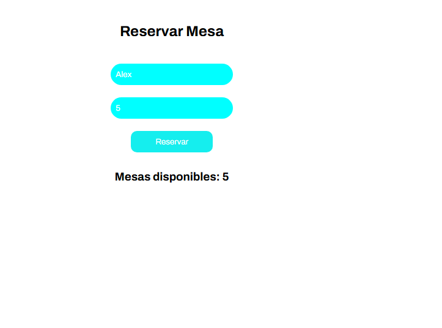
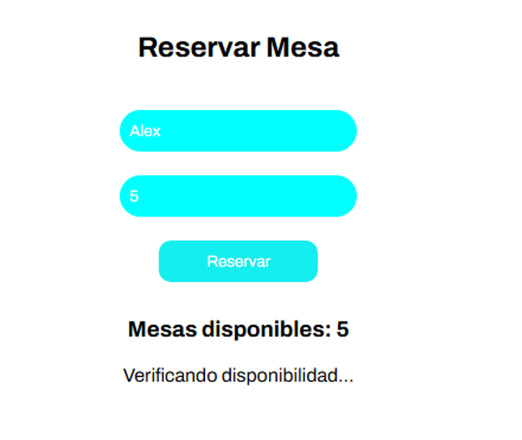
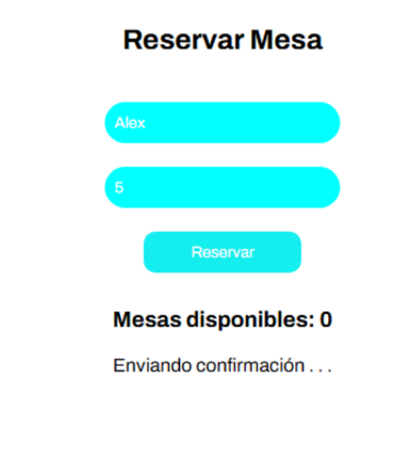
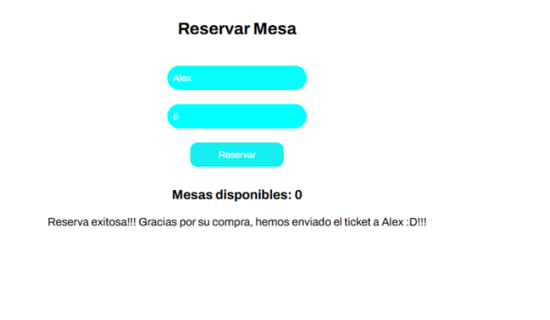

# Lección 04 - Promesas y Async/Await: Sistema de Reservas para un Restaurante
Ambos conceptos, promesas y async/await, son fundamentales para cualquier programador JavaScript moderno. El dominio de estas herramientas facilitará la creación de aplicaciones web más complejas y eficientes, al mismo tiempo que mejorará la legibilidad y la mantenibilidad del código.

Problema: Sistema de Reservas para un Restaurante
Imagina que tienes un restaurante y deseas permitir a los clientes hacer reservas en línea. Para ello, el sistema debe hacer las siguientes acciones:

1. Verificar si hay mesas disponibles para el día y la hora solicitados.
2. Si las mesas están disponibles, confirmar la reserva.
3. Si todo está bien, enviar un correo de confirmación.
4. Manejar adecuadamente los errores (si no hay mesas disponibles o si hay un fallo en el envío del correo).


## Archivos del repositorio

- **./practica-leccion/index.html**: Archivo HTML del proyecto, conectando el script.js 

- **./practica-leccion/style.css**: Archivo CSS del proyecto, conteniendo los estilos del proyecto

- **./practica-leccion/script/app.js**: Archivo de Javascript con la práctica realizada para este proyecto


- **./capturas/Captura1.png**: Captura de pantalla inicial
- **./capturas/Captura2.png**: Captura de pantalla del verificando disponibilidad 
- **./capturas/Captura3.png**: Captura de pantalla del enviando confirmacion 
- **./capturas/Captura4.png**: Captura de pantalla del mensaje de exito 


## Aprendizajes:

- Aplicación de promesas 
- Aplicación de async-await


## Evidencia visual

A continuación se muestra una captura de pantalla del código funcionando en la consola del navegador:







## Ejemplo de uso

Abra el archivo 
```./practica-leccion/index.html```
en su navegador y revise el sitio web para probar la funcionalidad del mismo

También puede mirar el código de JavaScript abriendo el archivo
```./practica-leccion/script/app.js```
dentro de su editor de código preferido o dentro de Github.

## Despliegue

Se desplegó en Github Pages a partir de este repositorio, puedes ver la página a través del siguiente link:
https://mor4n.github.io/05-desarrollo-avanzado-en-javascript/04-promesas-y-async-await/practica-leccion/index.html


## Como conclusión personal:
En esta práctica pude aprender más sobre async-await y promesas, los cuales siento que son clave para hacer un programa que pueda "hacer muchas cosas a la vez" por así decirlo, esperando una respuesta en lo que puede hacer otra cosa sin bloquear el programa como tal.
Creo que la parte de la sintaxis de promesa es la que se me complica un poco aún, más que del async-await, pero siento que pude reforzarlo con este ejercicio :D

