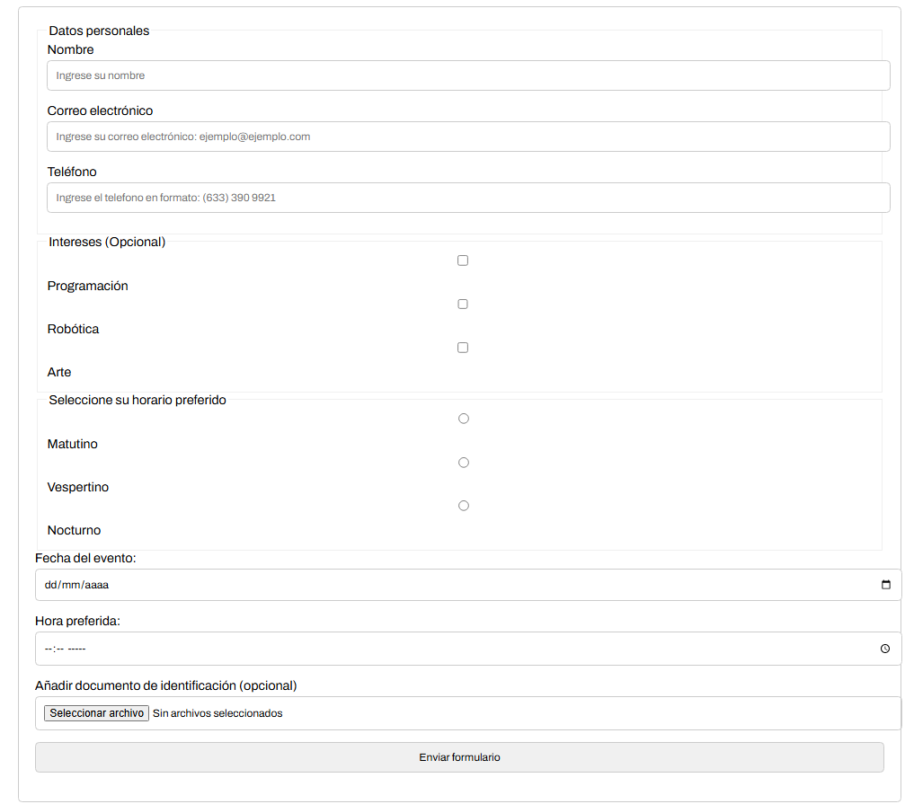
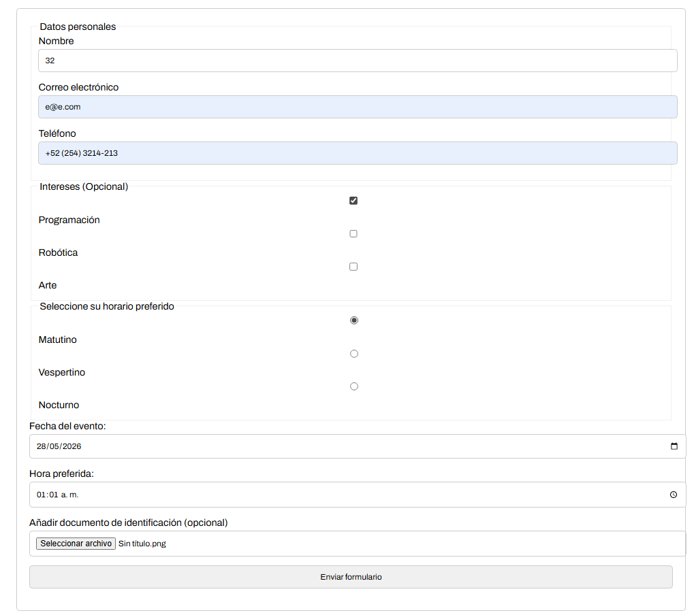
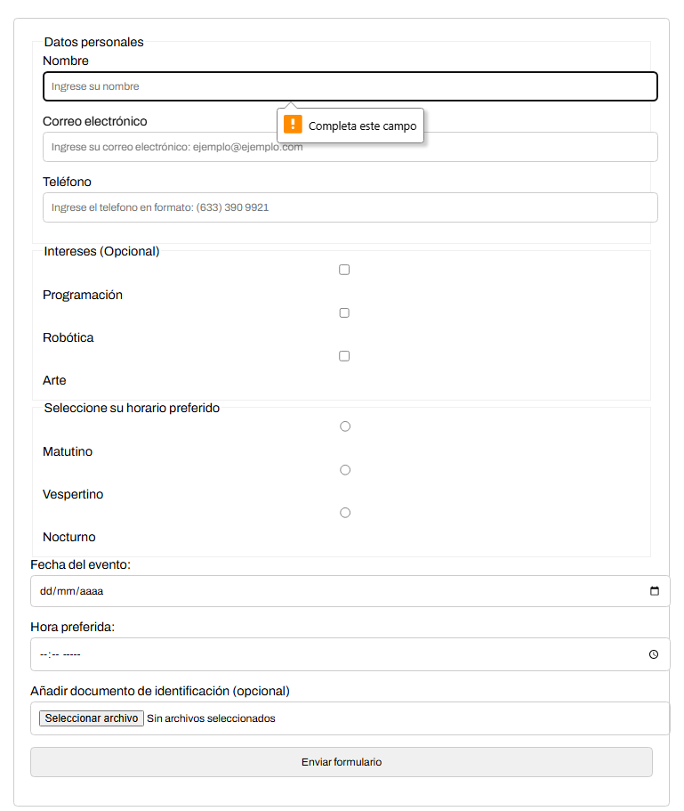
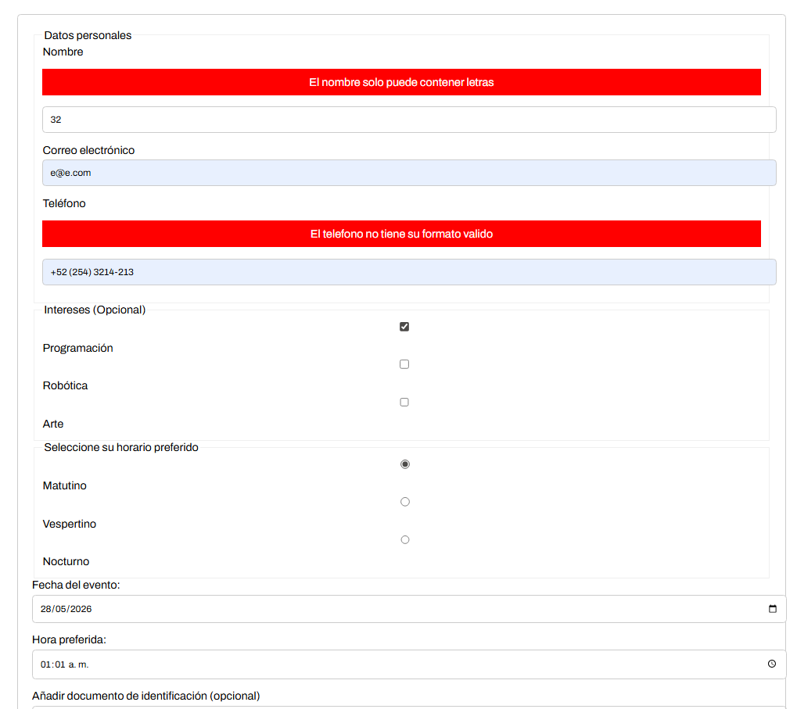
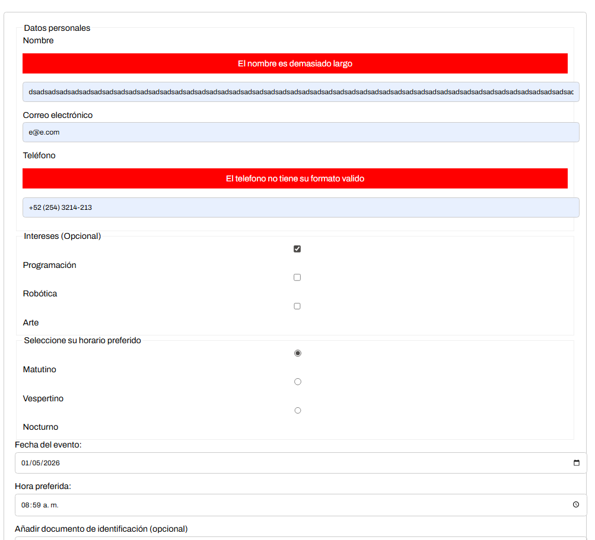

# Lección 05 - Manejo de Formularios: Formulario para Registro de Eventos

El manejo de formularios es una habilidad esencial para cualquier desarrollador web. Implica no solo capturar y validar datos, sino también garantizar una experiencia de usuario fluida y segura. Dominar estos conceptos te prepara para trabajar en proyectos interactivos y conectados a servicios en línea.

Objetivo
Crear un formulario funcional que cubra las siguientes características:

1. Capturar datos del usuario como nombre, correo electrónico y teléfono.
2. Seleccionar intereses usando casillas de verificación.
3. Elegir el horario preferido con botones de radio.
4. Seleccionar una fecha para el evento.
5. Subir un archivo opcional (como una identificación).
6. Validar los datos antes de enviarlos.

- Formulario para Registro de Eventos:
Una empresa organiza eventos regularmente y desea digitalizar el registro de asistentes. Necesitan un formulario web que permita a los usuarios registrarse ingresando su información personal, seleccionando sus intereses relacionados con el evento, eligiendo un horario para asistir y, opcionalmente, subiendo algún documento de identificación. Además, el formulario debe validar que los datos estén correctamente ingresados antes de enviarse.


## Archivos del repositorio

- **./practica-leccion/index.html**: Archivo HTML del proyecto, conectando el script.js 

- **./practica-leccion/style.css**: Archivo CSS del proyecto, conteniendo los estilos del proyecto

- **./practica-leccion/script/app.js**: Archivo de Javascript con la práctica realizada para este proyecto


- **./capturas/Captura1.png**: Captura de pantalla inicial del programa
- **./capturas/Captura2.png**: Captura de pantalla con datos llenados
- **./capturas/Captura3.png**: Captura de pantalla con validación de required
- **./capturas/Captura4.png**: Captura de pantalla con validación de nombre con carácteres que no son letras y de formato de número de teléfono
- **./capturas/Captura5.png**: Captura de pantalla con validación de nombre demasiado largo


## Aprendizajes:

- Uso de expresiones regulares para validar correos y números teléfonicos
- Validación de formularios en Javascript
- Uso de required


## Evidencia visual

A continuación se muestra una captura de pantalla del programa funcionando en el navegador:




A continuación se muestra una captura de pantalla con datos llenados:



A continuación se muestra una captura de pantalla con validación de campos requeridos:



A continuación se muestra una captura de pantalla con validación de nombre con caracteres que no son letras y formato de número de teléfono:



A continuación se muestra una captura de pantalla con validación de nombre demasiado largo:




## Ejemplo de uso

Abra el archivo 
```./practica-leccion/index.html```
en su navegador y revise el sitio web para probar la funcionalidad del mismo

También puede mirar el código de JavaScript abriendo el archivo
```./practica-leccion/script/app.js```
dentro de su editor de código preferido o dentro de Github.

## Despliegue

Se desplegó en Github Pages a partir de este repositorio, puedes ver la página a través del siguiente link:
https://mor4n.github.io/05-desarrollo-avanzado-en-javascript/06-validacion-de-formularios-con-Zod/practica-leccion/index.html


## Como conclusión personal:
En esta práctica pude aprender a como validar formularios, tema que es importante tanto para mantener la seguridad tanto del usuario como de la base de datos, así podemos mantener una consistencia de datos e incluso, evitar que usuarios maliciosos traten de entrar a vulnerar nuestro sistema mediante una inyección SQL u otro tipo de ataque.
Me encantó la parte de expresiones regulares, siento que es algo demasiado útil para verificar los correo electrónicos como el número de teléfono, que es algo que puede escribirse de muchas formas y con esto, lo estamos limitando a una sola para mantener la consistencia de datos :D
Las validaciones que hice fueron:
- Longitud de nombre
- Validación de letras con regex
- Formato de teléfono con regex
- Solo formato .png en identificación


