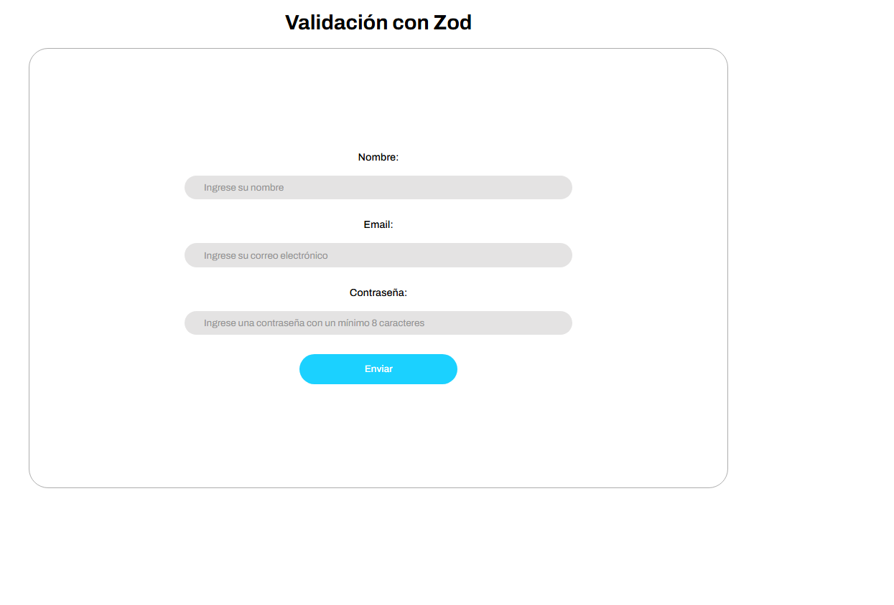
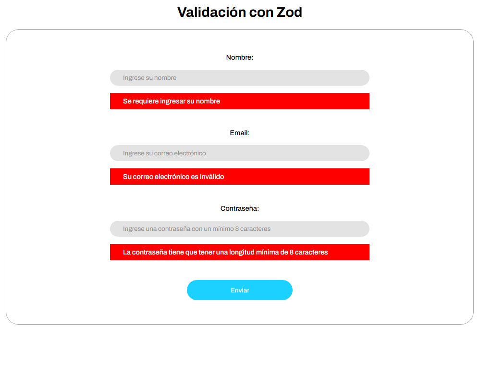
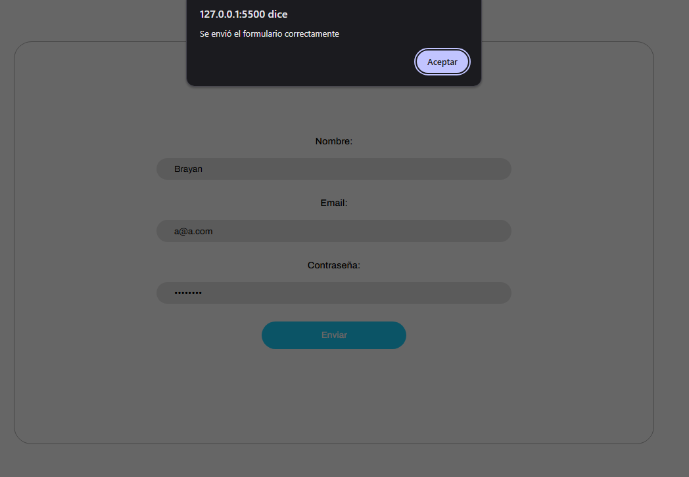

# Lección 06 - Validación de formularios con Zod: Validación de un Formulario de Registro con Zod
La validación de datos con Zod es una manera efectiva y estructurada de manejar entradas de usuarios en formularios. Define esquemas claros, valida datos fácilmente y mejora la experiencia del usuario al proporcionar mensajes de error significativos. Al practicar con Zod, estarás mejor preparado para manejar formularios y datos en tus proyectos.

Con este proyecto esperamos que puedas:

1. Practicar el uso de Zod para validar datos de un formulario.
2. Implementar validación en tiempo real para mejorar la experiencia del usuario.
3. Comprender cómo manejar errores de validación y mostrar mensajes amigables.

Validación de un Formulario de Registro con Zod

Crearás un formulario de registro que solicite al usuario su **nombre**, **correo electrónico**, y **contraseña**. Los datos ingresados deben validarse utilizando la biblioteca **Zod** antes de enviarlos al servidor. El formulario debe mostrar mensajes de error claros si los datos no son válidos.


## Archivos del repositorio

- **./practica-leccion/index.html**: Archivo HTML del proyecto, conectando el script.js 

- **./practica-leccion/style.css**: Archivo CSS del proyecto, conteniendo los estilos del proyecto

- **./practica-leccion/script/app.js**: Archivo de Javascript con la práctica realizada para este proyecto, tanto en consola como con interfaz con el HTML.


- **./capturas/Captura1.png**: Captura de pantalla de HTML inicial
- **./capturas/Captura2.png**: Captura de pantalla del HTML con errores de validación
- **./capturas/Captura2.png**: Captura de pantalla del HTML del formulario enviado exitosamente


## Aprendizajes:

- Validación de formularios con Zod


## Evidencia visual

A continuación se muestra una captura de pantalla del código funcionando en la consola del navegador:






## Ejemplo de uso

Abra el archivo 
```./practica-leccion/index.html```
en su navegador y revise el sitio web para probar la funcionalidad del mismo

También puede mirar el código de JavaScript abriendo el archivo
```./practica-leccion/script/app.js```
dentro de su editor de código preferido o dentro de Github.

## Despliegue

Se desplegó en Github Pages a partir de este repositorio, puedes ver la página a través del siguiente link:
https://mor4n.github.io/05-desarrollo-avanzado-en-javascript/06-validacion-de-formularios-con-Zod/practica-leccion/index.html


## Como conclusión personal:
En esta práctica pude aprender a como validar formularios con Zod, el cual es una librería que nos permite realizar eso, aunque también nos permite realizar otras cosas.
Se me hizo bastante genial porque es bastante sencillo de usar, solo se tenía que realizar el esquema de la validación, obtener los datos del formulario y basicamente comparar el esquema que tenemos con el objeto de los datos del formulario! aparte de eso, se me hizo súper sencillo la forma en decirle "quiero que este sea este tipo de dato y si no lo usa, este será el error que se va a devolver"!!


