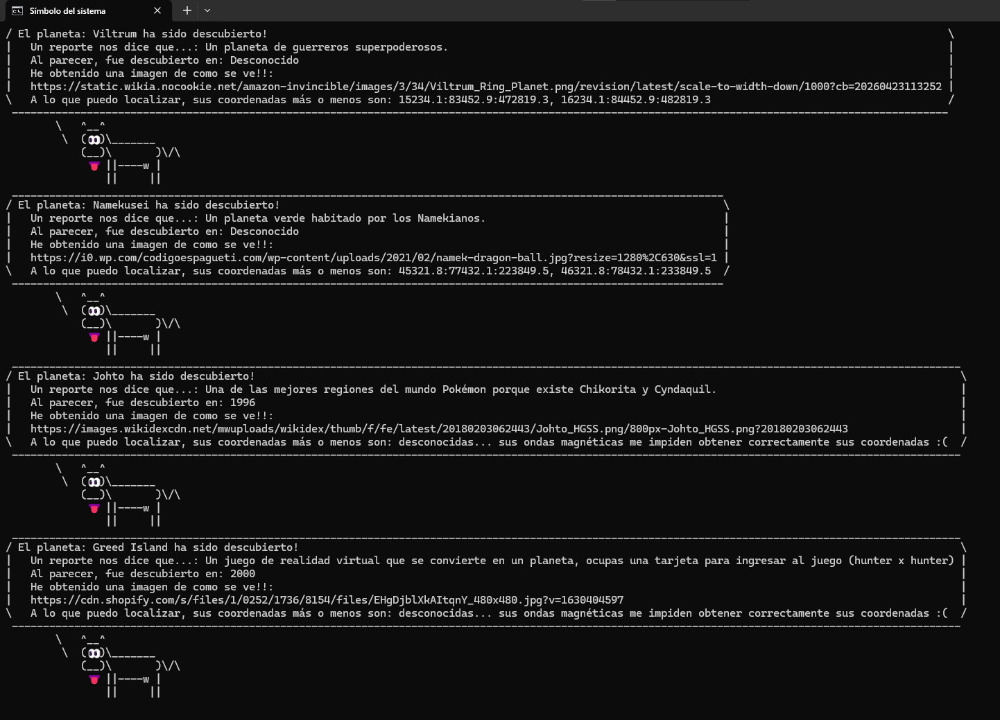

# Lección 07 - Intro a Node.js y npm: Taller: ¡Node.js para Novatos Aventureros!


## Archivos del repositorio


- **./practica-leccion/mi-exploracion-espacial/index.js**: Archivo de Javascript con la práctica realizada para este proyecto 
- **./practica-leccion/mi-exploracion-espacial/planetas.js**: Archivo de Javascript con el objeto de planetas que se importa en index.js

- **./capturas/Captura1.png**: Captura de pantalla con el resultado del ejercicio en consola


## Aprendizajes:

- Uso de Node.JS
- Uso de npm
- Instalación de paquetes de npm como cowsay
- Modularidad, export e import


## Evidencia visual

A continuación se muestra una captura de pantalla del código funcionando en la consola del navegador:




## Ejemplo de uso

Entre a la carpeta 
```./practica-leccion/mi-exploracion-espacial/```
y ejecute el comando
``` npm run explorar```
en terminal para ver el resultado

También puede mirar el código de JavaScript abriendo el archivo
```./practica-leccion/mi-exploracion-espacial/index.js```
y
```./practica-leccion/mi-exploracion-espacial/planetas.js```
dentro de su editor de código preferido o dentro de Github.


## Como conclusión personal:
En esta práctica pude aprender un poco más sobre el uso de Node.JS y de npm, me parecío bastante divertida la práctica al añadir los planetas y al hacer paso por paso la guía del gist :D (y estuvo bien chistosa la parte del paquete de cowsay JDSAK), en conjunto con la clase, pude aprender más sobre la modularidad de los archivos al exportar e importar cosas, haciendo el código más mantenible y legible para un futuro.

## Fuentes:
https://github.com/piuccio/cowsay
