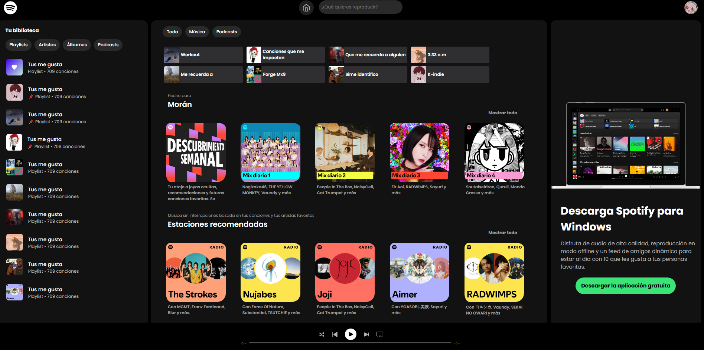

# Leccion 08 - Intro a Vite

## Proyecto

Mini clon de Spotify desarrollado con Vite y JavaScript por módulos.


## Estructura del repositorio

- `./practica-leccion/spotify/index.html`: Archivo inicial de HTML.

- `./practica-leccion/spotify/src/main.js`: Une Navbar, Sidebar, Content, Download y MusicPlayer

- `./practica-leccion/spotify/src/style.css`: Estilos para todo el proyecto

- `./practica-leccion/spotify/src/components/`: Componentes principales y common

- `./practica-leccion/spotify/src/barrels/assets.js`: Barrel de imagenes e iconos

- `./practica-leccion/spotify/src/barrels/data.js`: Datos como objetos que uso en el proyecto para mostrarlos dinamicamente

- `./capturas/Captura1.png`: Resultado final

## Tecnologias

- Vite
- JavaScript (ES Modules)
- HTML5
- CSS3

## Aprendizajes

- Inicializar y ejecutar un proyecto con Vite
- Organizar una UI en componentes reutilizables
- Uso de objetos para mostrar datos dinamicamente en un módulo mediante map
- Usar barrels para centralizar imports de assets y datos
- Separar estructura (`index.html`), logica (`src/`) y estilos (`src/style.css`)


## Evidencia visual

A continuación se muestra una captura de pantalla del proyecto funcionando:




## Ejemplo de uso

1. Entra a la carpeta del proyecto:

```bash
cd ./practica-leccion/spotify
```

2. Instala dependencias:

```bash
npm install
```

3. Inicia el servidor de desarrollo:

```bash
npm run dev
```

4. Abre en el navegador la URL que te muestre Vite (en mi caso fue `http://localhost:5173`).


## Despliegue

Se desplegó en Github Pages a partir de este repositorio, puedes ver la página a través del siguiente link:
https://spotify-modular.netlify.app/

## Como conclusión personal:

En este proyecto pude aprender DEMASIADO, siento que es como una introducción a lo que veremos en React, pude aprender a como hacer por módulos un proyecto (nunca me imaginé la verdad que se pudiera hacer de la forma en la que nos enseñó Ó_Ó) y esto se me hizo demasiado importante y poderoso, en este caso, quise volver a hacer la intefaz de Spotify que había hecho para el Reto 3 de CSS del módulo 2, y realmente fue súper fácil y sencillo hacerlo, hice menos líneas de código por la reutilización de módulos y fue ultra genial!!
Donde llegué a tener trabas es cuando quise recorrer los objetos de información que creé (para no estar llamando muchas veces a una función solo cambiando la información).
Mi problema fue que lo quise hacer con forEach y me daba undefined, luego revisando las notas de la clase me di cuenta que se tenía que realizar con .map y con eso se pudo hacer de forma dinámica por así decirlo el desplegado de datos :''D!
En serio, con todo esto siento que conecté demasiados temas y me llevo un ultra gran sabor de boca con lo que pude aprender! Muchas gracias


